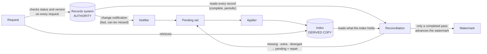

# Architecture artefacts — keeping a knowledge base current

Five things to take away from Episode 03 and reuse on your own systems. Each one names the decision record it comes
from, so you can see the reasoning behind it.

---

## 1 · The four-state card (ADR-002)

Every retrieval candidate is in exactly one state. Only one state is ever served.

| State | Meaning | Served? |
|---|---|---|
| **Known current** | Authority says this version is in force, and derived state matches it | **Yes** |
| **Known pending** | A change is known, and derived state has not caught up | No — never served as current |
| **Known gone** | Superseded, withdrawn or deleted in the authoritative record | No |
| **Unknown** | The system cannot establish the state | No |

> **Unknown derived state is not trusted.** An age is not a state: "it was indexed 30 seconds ago" says nothing about
> whether it is still current.

In the lab, the withdrawn document's copy was *present* in the index and *known gone* by authority, so it was refused.

---

## 2 · The two-lane diagram (ADR-003)



- **Lane 1 — notifications** are fast and partial. They make the index converge sooner. They can never prove that
  nothing was missed.
- **Lane 2 — reconciliation** reads the authority and the index and compares them. It is the only mechanism allowed
  to claim completeness, and it repairs what it finds.
- **The request** does not trust either lane. It confirms what it retrieved against the authority, every time.

---

## 3 · The watermark definition (ADR-003, ADR-007)

> **For this change class, every authoritative change effective at or before T has been applied to derived state or is
> listed as pending.**

- It is a statement about **completeness of knowledge**, not processing progress.
- It advances **only** through a completed reconciliation pass, and only to the moment that pass **started**.
- A notification **never** advances it.
- Each change class has its own watermark. The global floor is the lowest of them, so a class that is behind is never
  hidden by one that is up to date.

---

## 4 · The escalation contract (ADR-007 §3; FRS-004, OPS-001)

A change that cannot be applied:

1. **stays pending** — it is recorded as failed, never dropped;
2. **keeps its clock** — `noticed_at` is when it was *first* noticed, and a retry never resets it;
3. **is retried** through the real application path, and every attempt is counted;
4. **escalates once** when it outlives its class's window, and the alert names the **change class** and the
   **document**;
5. **clears** when the change is applied, and the alarm returns to normal without being reset by hand.

Working windows used in the lab (engagement values, not universal rules):

| Change class | Window |
|---|---|
| Supersede or withdraw | 0 s — effective from the next request |
| Upward reclassification | 0 s |
| New version | 4 hours |
| Downward reclassification | 24 hours |
| Deletion | 30 days |

---

## 5 · Your own architecture note (template)

Fill this in after the lab, in your own words.

```
SYSTEM:           <the knowledge base or cache you are responsible for>
AUTHORITY:        <which system is the source of truth for status, version and classification?>
DERIVED COPIES:   <every index, cache or replica built from it>

1. When authority withdraws a document, what stops a copy that is still present from being served?
   (In the lab: the copy matched on label, scope and version. What refused it?)

2. What would tell you that a change was never delivered at all?

3. What is your watermark, and what is the only thing allowed to advance it?

4. A change fails to apply at 02:00. Who finds out, when, and what does the alert name?

5. What does your system do while it cannot prove completeness?
```

---

## The three sentences

**Events accelerate convergence. Authority determines truth. Reconciliation restores consistency.**
